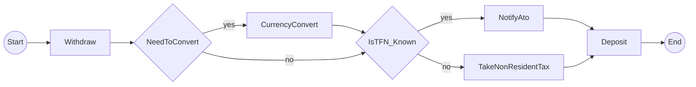
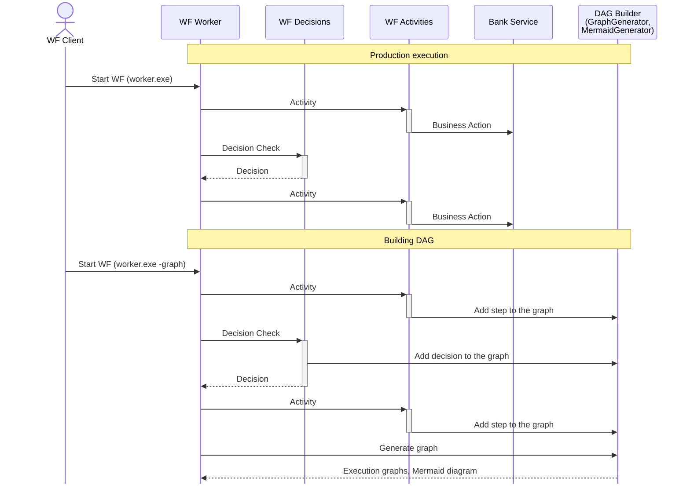
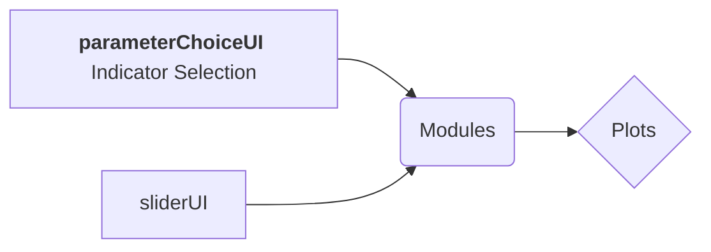

Running worker...
```
Start > Withdraw > decision1{NeedToConvert}:no > decision0{IsTFN_Known}:yes > NotifyAto > Deposit > End
Start > Withdraw > decision1{NeedToConvert}:no > decision0{IsTFN_Known}:no > TakeNonResidentTax > Deposit > End
Start > Withdraw > decision1{NeedToConvert}:yes > CurrencyConvert > decision0{IsTFN_Known}:yes > NotifyAto > Deposit > End
Start > Withdraw > decision1{NeedToConvert}:yes > CurrencyConvert > decision0{IsTFN_Known}:no > TakeNonResidentTax > Deposit > End
```






