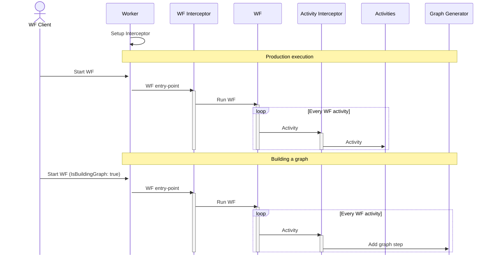

## Problem Statement

When it comes to the WorkFlow (WF) engines, many of them based on the concept of [Directed Acyclic Graph](https://en.wikipedia.org/wiki/Directed_acyclic_graph) (DAG). 

The obvious limitation of DAG (inability to support loops) comes with the great benefit - visualizing the whole WF is easy as it is often defined up front as a DSL specification of the complete graph.

Temporal belongs to the DAG-less family of WF engines. Thus, of the box, it offers somewhat limited visualization capabilities that are sacrificed for the more flexible architecture.  

Temporal (out of the box) only offers the WF visualization for the already executed steps - Timeline View. This creates a capability gap for the UI scenarios when it is beneficial to see the whole WH regardless how far the execution progressed. The problem has been detected and even [discussed](https://community.temporal.io/t/see-workflow-as-a-dag/2010) in the Temporal community but without any significant progress in addressing it. 

This project is an attempt to feel this gap.

## Solution
_Note: this project specifically trargets .NET binding for Temporal._

`Temporalio.Graphs` is a library (NuGet package) that can be used to generate a complete WF graph by running the WF in the mocked-run mode when all WF activities are mocked and only log the graph steps during the execution.

In order to achieve that you will need to add `Temporalio.Graphs` NuGet package to your worker project and then do the following steps:

- Add `GraphBuilder` to your worker as an interceptor in the Program.cs file:
  ```c#
   var workerOptions = new TemporalWorkerOptions(taskQueue: "MONEY_TRANSFER_TASK_QUEUE")
   {
       Interceptors = [new Temporalio.Graphs.GraphBuilder()]
   };
   . . .
   using var worker = new TemporalWorker(client, workerOptions);
  ```
  
That's it. Now you can run your WF either as normal or in a graph-generation mode when all WF actions are replaced at runtime with mocks and the graph definition is generated. 

This is how you can do it from the worker application.

```c#
bool isBuildingGraph = args.Contains("-graph");

if (isBuildingGraph)
{
    interceptor.Context = new Temporalio.Graphs.ExecutionContext(
        IsBuildingGraph: true,
        ExitAfterBuildingGraph: true,
        GraphOutputFile: typeof(MoneyTransferWorkflow).Assembly.Location.ChangeExtension(".graph"));

    await workerOptions.ExecuteWorkerInMemory(
        (MoneyTransferWorkflow wf) => wf.RunAsync(null));
}
else
{
    // normal execution
    . . .
```

When the graph is generated its definition (see section below) is printed in the console window. Alternatively you can redirect it to the file (UNC or relative to the worker location). Use `ExecutionContext.GraphOutputFile` for that.  

Note WF decision is a special type of a WF action (step) that requires special way of declaring it. This is because Temporal does not recognize Decision as a fist class citizen but instead lets user encoding WS decision nodes as simple programming language conditional statements. This works quite well as Temporal is not concern about the graphs but only logs. However if you are building the graph and wantto capture the decision node then you need to encode it as an Activity which returns either `"True"` or `"False"` strings. You will also need to mark this activity with a new attribute `DecicionAttribute`:

```c#
[Activity]
[Decision]
public static string NeedToConvert(PaymentDetails details)
{
    return (details.Currency != "AUD").ToString();
}
```

And this is how you can use this DecicionActvity:

```c#
bool needToConvert = await this.Decision(() => BankingActivities.NeedToConvert(details));

if (needToConvert)
{
    await ExecuteActivityAsync(
        () => BankingActivities.CurrencyConvertAsync(details), options);
}
```
Note the use of the extension method `Decision`, which converts the Activity return string into `bool` for convenient use in C# conditions.

### Graphs Output

When the graph is generated the result is either printed in the console output or to the file. The result is a text that consist of three sections as on the screenshot below:


1. The first section is the actual WF graph. This is the primary graph generation result. In the section text each line represents a graph unique path. If there is no decision node in the WF graph then there is only one path possible. The path definition is captured in this simple format:

   ```
   Start > step1_name > ... > stepN_name > End
   ```

   The decision nodes are just as ordinary nodes (steps) but since decisions have richer execution context their names include the decision id and the result (yes or no):
   
   ```
   id{Name}:result
   ```

   The decision result defines the execution outcome - a single graph path. The amount of possible WF path is the amount of all permutations of the decisions int the WF. Thus if there are two decisions ro be made at runtime then there are four possible execution paths (graph paths). Thus the graph section will have four lines in total. 

   ```txt
   Start > Withdraw > 0{NeedToConvert}:yes > CurrencyConvert > 1{IsTFN_Known}:yes > NotifyAto > Deposit > End
   Start > Withdraw > 0{NeedToConvert}:yes > CurrencyConvert > 1{IsTFN_Known}:no > TakeNonResidentTax > Deposit > End
   Start > Withdraw > 0{NeedToConvert}:no > 1{IsTFN_Known}:yes > NotifyAto > Deposit > End
   Start > Withdraw > 0{NeedToConvert}:no > 1{IsTFN_Known}:no > TakeNonResidentTax > Deposit > End
   ```

   You can use the graph definition to visualize WF in front-end app. Parsing/interpreting the definition is quite easy due to the very simple syntax.

2. The second section contains an alternative syntax of the WF definition - Mermaid syntax. It is a great way to verify the accuracy of the generated graph. It can also be used as a foundation for visualization of the live workflow (see interactive [visualization sample](https://www.cs-script.net/Temporalio.Graphs/Samples/wf.mermaid.sim.html)). 
If you only want to verify the accuracy of te graph then paste the section content in any Mermaid rendering host. IE GitHub markdown document renders Mermaid diagrams natively. Below is the Mermaid specification from the screenshot above that is rendered by Github: 

   ````markdown
   ```mermaid
   flowchart LR
   s((Start)) --> Withdraw --> 0{NeedToConvert} -- yes --> CurrencyConvert --> 1{IsTFN_Known} -- yes --> NotifyAto --> Deposit --> e((End))
   1{IsTFN_Known} -- no --> TakeNonResidentTax --> Deposit
   0{NeedToConvert} -- no --> 1{IsTFN_Known}
   ```
   ````

   ```mermaid
   flowchart LR
   s((Start)) --> Withdraw --> 0{NeedToConvert} -- yes --> CurrencyConvert --> 1{IsTFN_Known} -- yes --> NotifyAto --> Deposit --> e((End))
   1{IsTFN_Known} -- no --> TakeNonResidentTax --> Deposit
   0{NeedToConvert} -- no --> 1{IsTFN_Known}
   ```

3. The third section contains validation result. The validation is performed at the end of the graph generation. The validation is a simple technique of verifying that all the Temporal Actions defined in the assembly are captured in the graph. If not, then it may mean that you made a mistake in your WF definition or just have some not needed WF actions defined.

   ```
   WARNING: the following activities are not present in the full WF graph:
   Temporalio.MoneyTransferProject.MoneyTransferWorker.BankingActivities.RefundAsync,
   Temporalio.MoneyTransferProject.MoneyTransferWorker.BankingActivities.DeliberatelyAbandonedActivityAsync
   ```

## How it works under the hood

The idea behind WF graph generation is quite simple. All WF actions are the nodes (steps) in the WF graph. Thus if you execute the WF from the start to the end and record the names of teh actions being executes, you have a complete accurate graph path. The only thing that you need to take care of is to avoid executing the WF action business logic during the graph building execution.




## Prerequisites

Before running this application, ensure you have the following installed:

* [.NET 8.0 SDK](https://dotnet.microsoft.com/en-us/download/dotnet/8.0) or later
* [Temporal CLI](https://learn.temporal.io/getting_started/dotnet/dev_environment/)

## Steps to get started

1. _**Build the solution**_
2. _**Start the WF worker**_
   `MoneyTransferWorker.exe  -graph`
   This will generate `MoneyTransferWorker.graph` file with the WF graph

The WF worker will generate the unique execution graphs for the WF executed in the mocked mode. It will also generate the Mermaid diagram representing the whole DAG as well as the WF graphs validation result. The worker will be executed without connecting to the live Temporal Server. It will connect toi the inmemory server instead.

Thus the worker assembly has no runtime dependency so it can be used to generate the graph on CI without any difficulties.

The routine that triggers the mocked execution is part of the worker setup (`program.cs`):

```c#
bool isBuildingGraph = args.Contains("-graph");

if (isBuildingGraph)
{
    interceptor.Context = new Temporalio.Graphs.ExecutionContext(
        IsBuildingGraph: true,
        ExitAfterBuildingGraph: true,
        GraphOutputFile: typeof(MoneyTransferWorkflow).Assembly.Location.ChangeExtension(".graph"));

    await workerOptions.ExecuteWorkerInMemory(
        (MoneyTransferWorkflow wf) => wf.RunAsync(null));
}
else
{
   // normal execution
}
```

If it is required to generate the graph of the running instance then you can achieve this by passing the `ExecutionContext` object to the `RunAsync` as a parameter from the client application. The instance of GraphBuilder interceptor will detect and handle the parameter for the client. You will need to add this parameter to the `RunAsync` signature.  
