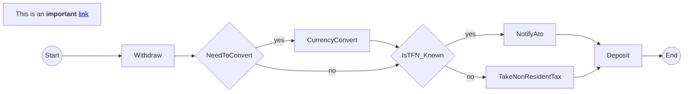
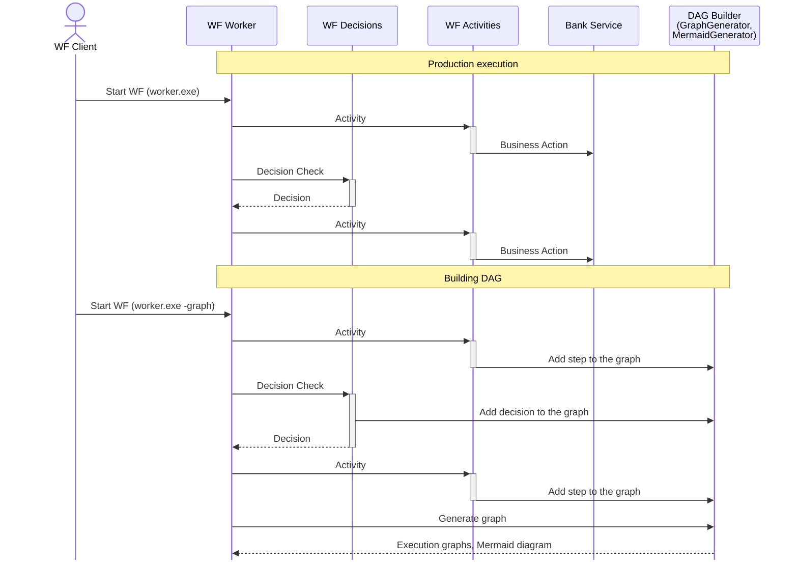

## Problem Statement

When it comes to the WorkFlow (WF) engines. Many of them flw

## Solution

### Graphs

The 

### The whole DAG



### Graph Validation
```
WARNING: the following activities are not present in the full DAG: [Temporalio.MoneyTransferProject.MoneyTransferWorker.BankingActivities.DeliberatelyAbandonedActivityAsync]
This is either because the activity was not run during the WF execution or because the activity does not have the following statement as the first line in the implementation block:
    if (Dag.IsBuildingGraph)
        return Dag.ActiveGraph.AddStep();
WARNING: the following decisions are not present in the full DAG: [Temporalio.MoneyTransferProject.MoneyTransferWorker.Decisions.AbandonedTestDecision]
This is either because the decision or its all permutations were not evaluated during the WF execution or because it was not implemented correctly.
See Temporalio.Graphs samples.
```

## How it works




## Prerequisites

Before running this application, ensure you have the following installed:

* [.NET 8.0 SDK](https://dotnet.microsoft.com/en-us/download/dotnet/8.0) or later
* [Temporal CLI](https://learn.temporal.io/getting_started/dotnet/dev_environment/)

## Steps to get started

1. _**Build the solution**_
2. _**Start the Temporal Server**_
   `temporal server start-dev`
3. _**Start the WF worker**_
   `MoneyTransferWorker.exe`
4. _**Start the WF in build graph mode**_
   `MoneyTransferClient.exe -graph`

The WF worker will print the unique execution graphs for the WF executed in the mocked mod. It will also print the Mermaid diagram representing the whole DAG as well as the WF graphs validation result.